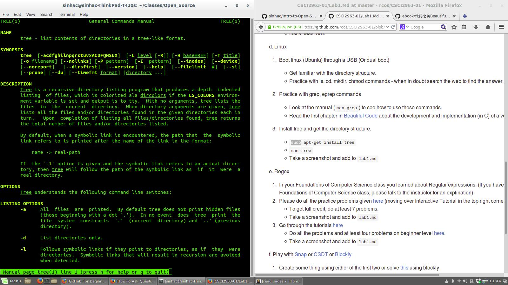
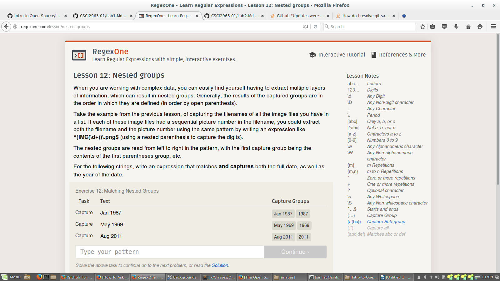

# Importance of 10 Open Source Criteria
## 1. Free Redistribution: no longer considered "open" if giving software away requires a royaltee or fee
## 2. Source Code: if the source code isn't shared, it will be hard to make the project maintainable because other people won't have access to it
## 3. Derived Works: changes can be made to original software
## 4. Integrity of the Author's Source Code: not sure why this one's important
## 5. No Discrimination Against Persons or Groups: otherwise the software isn't available to everyone, which it should be in order to be open source
## 6. No Discrimination Against Fields of Endeavor: the fact that the code can be used for any purpose makes it open source
## 7. Distribution of License: so the software can be redistributed repeatedly, without diminishing rights each time
## 8. License Must Not be Specific to a Product: if it is and the product is not open source, the licensed software must still be usable as if it weren't attached to the product
## 9. License Must Not Restrict Other Software: not sure why this is important
## 10. License Must Be Technology-Neutral: if the license only works for an individual technology, the software won't be open source because it excludes people who use other technologies
# 
# How To Answer Questions in a Helpful Way
## The list pretty much covers it. I would add upvoting good answers that work instead of just repeating the answer or not upvoting at all.
## Can't think of anything else except for agreeing with/stressing answering the actual question.
# 
